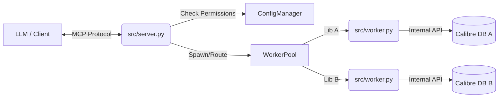

# Calibre MCP Server Architecture

## Overview

This project implements a Model Context Protocol (MCP) server for Calibre. Its primary goal is to allow AI agents to interact with a user's ebook library including searching metadata, reading book content, and performing full-text searches.

## The Challenge: Environment Isolation

Calibre is built on a highly customized Python environment. On Windows, it ships with a bundled Python (typically version 3.x) that includes:

- Custom C/C++ extensions for performance (Qt, lxml, etc.).
- A sandboxed structure that makes installing standard PyPI packages difficult.
- Incompatibility with binary wheels compiled for standard Python distributions (e.g., `pydantic-core` required by the `mcp` SDK).

Attempts to run the MCP server directly inside Calibre's environment usually fail due to these dependency mismatches (specifically `glibc` or ABI issues with `pydantic`).

## The Solution: Multi-Process Bridge Architecture

To overcome this, we employ a **Multi-Process Bridge Architecture**. This decouples the MCP protocol handling from the Calibre database access.

### Components

#### 1. The MCP Server (`src/server.py`)

- **Runtime**: System Python (e.g., Python 3.10+).
- **Dependencies**: `mcp` (FastMCP), `pydantic`, `anyio`.
- **Role**:
  - **Config Manager**: Loads `config.json` to manage libraries and permissions.
  - **Worker Pool**: Manages a pool of worker processes, one for each configured library.
  - **Security Enforcer**: Checks permissions (Read/Write) before routing requests.
  - **Router**: Forwards tool calls to the appropriate Worker via JSON-RPC.

#### 2. The Calibre Worker (`src/worker.py`)

- **Runtime**: Calibre's Internal Python (via `calibre-debug`).
- **Dependencies**: Standard Library only (`json`, `sys`, `os`).
- **Role**:
  - Imports `calibre.library.db.cache` to access `metadata.db` safely.
  - Executes library operations (Search, Get Metadata, File Access, Updates).
  - Serializes results to JSON.
  - **Isolation**: Each worker instance is dedicated to a single library path, ensuring thread safety and context isolation.

#### 3. The Communication Link

- **Protocol**: Simplified JSON-RPC 2.0.
- **Transport**: Standard Input/Output (Stdin/Stdout).
- **Flow**:
  1. Server identifies target library (or default).
  2. Server retrieves or spawns correct `calibre-debug` process.
  3. Server sends `{"method": "search_books", "params": {...}}` to Worker's stdin.
  4. Worker executes logic and prints response to stdout.
  5. Server parses response and returns it to the MCP client.

## Diagram

## Key Considerations

- **Concurrency**: The current implementation is synchronous per-request per-worker. The Server allows concurrent requests to *different* libraries.
- **Output Hygiene**: Calibre plugins often spam `stdout`. The Server is robust against non-JSON output from the Worker, allowing it to filter out warnings and debug signals.
- **Security**: 
  - **Library Isolation**: Access is restricted to paths defined in `config.json`.
  - **Write Protection**: Write operations are disabled by default and require explicit configuration.
